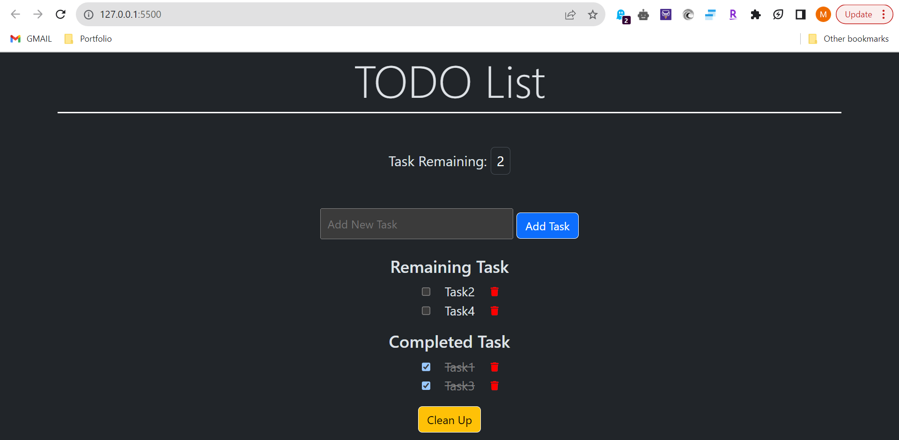
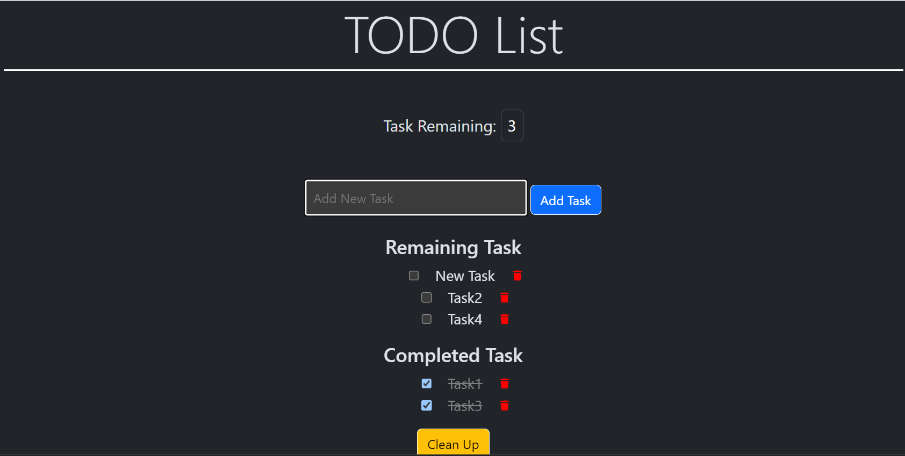
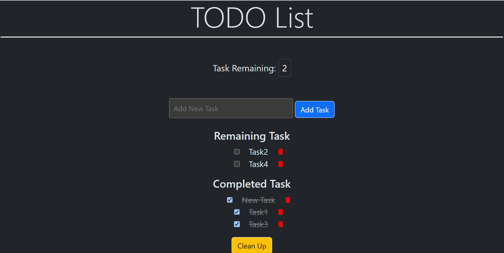
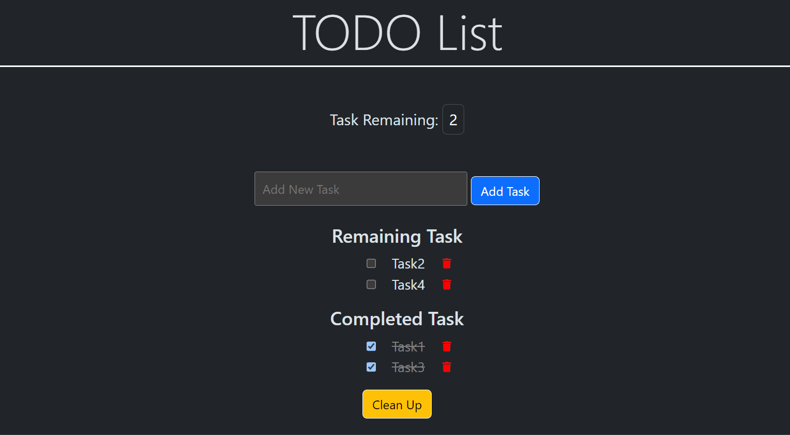
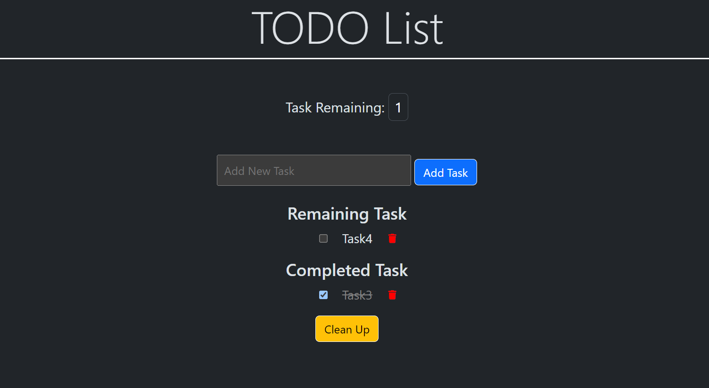
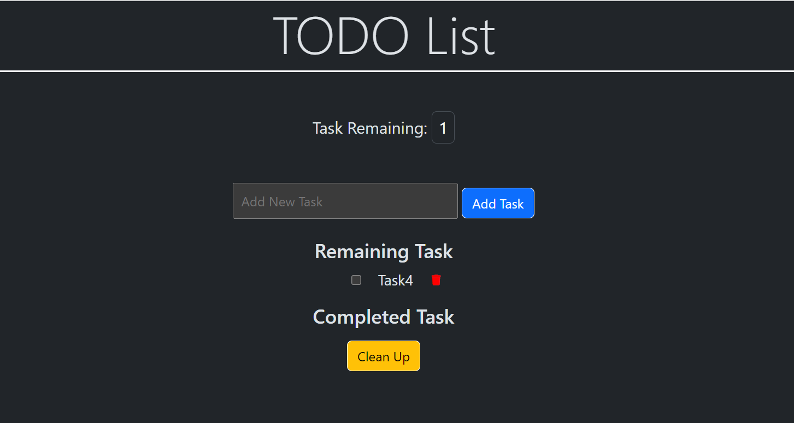

# Contact App

A TODO list app that features adding, shows remaining task count, marking completed task, delete individual task, clean all completed task at once as well as seperate list for remaining and completed task.

## Current features:

Add Task 
Complete Task 
Remove Task 
Remaining Task Count 
Clear Up 

## Local Development

Run index.html file.

## Snap Shots

1. Home Page 

2. Add New Task 

3. Complete New Task 

4. Deleted New Task 

5. Deleted Task 1 and 2

6. Clean Up

